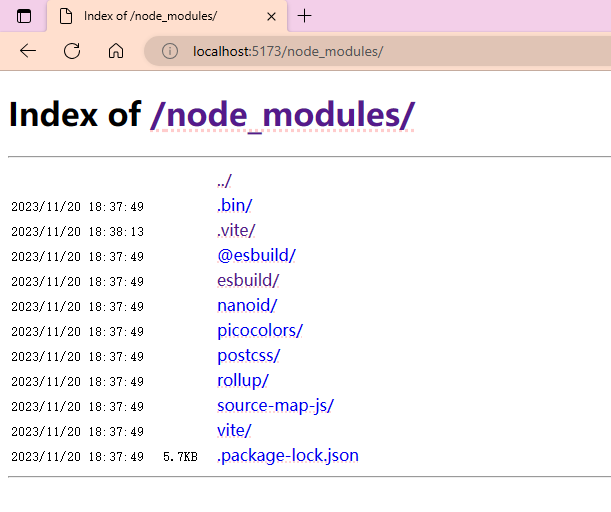

# vite-plugin-autoindex

vite-plugin-autoindex is a Vite plugin that automatically indexes the project files. It is designed to be used in multi-page applications where it becomes difficult to browse and find the entry points for different pages.

## Demo



## Features
- Automatically generates an index for all the files in the project
- Provides an easy way to browse and find specific page entry points
- Streamlines the development process in multi-page applications

## Installation
You can install the plugin using npm:

```bash
npm install vite-plugin-autoindex --save-dev
```

## Usage
Once installed, you can use the plugin in your Vite configuration file (`vite.config.js`). Here is an example:

```javascript
// vite.config.js
import { defineConfig } from 'vite'
import autoindex from '@yuanliwei/vite-plugin-autoindex'

export default defineConfig({
  plugins: [
    autoindex()
  ]
})
```

## License
This plugin is licensed under the MIT license. See [LICENSE](LICENSE) for more information.
 
